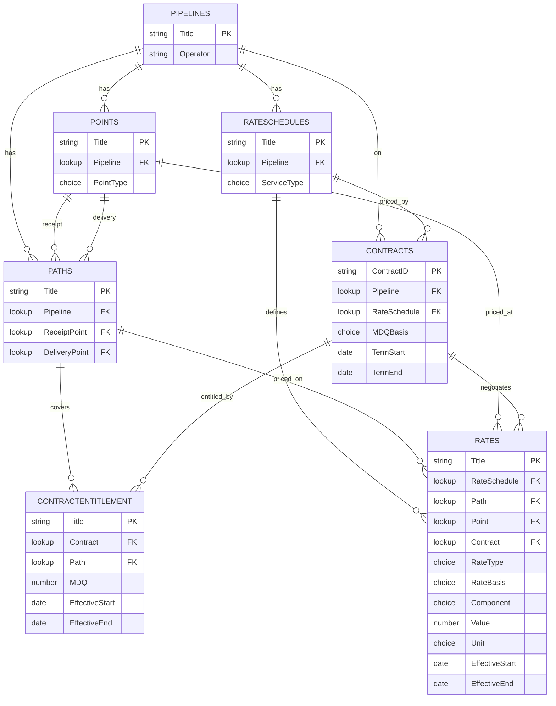

# Pipeline contract-rate database — build guide (FLARE)

Manual setup instructions for the seven SharePoint lists that make up the contract-rate database on the FLARE site, built by hand (more reliable than the List Agent for lookups). Learn the one procedure below, then apply the per-list column specs in order.

Everywhere `<tenant>` appears, substitute your SharePoint tenant so the site URL reads `https://<tenant>.sharepoint.com/sites/FLARE`.

---

## Data model

Seven lists. Dimensions (Pipelines, RateSchedules, Points) feed the bridge (Paths) and the two effective-dated fact tables (Rates, ContractEntitlement). Each `FK` is a SharePoint lookup column. A contract has one rate schedule but can hold capacity across multiple paths, so path lives on the entitlement rows — one per contract, per path, per period. Rates is stored tall — one row per rate component (reservation, commodity, fuel, surcharge) — so each component carries its own value, unit, and effective window. Rates holds both the shared recourse/tariff curve **and** contract-specific negotiated/discount rates in one list: a **nullable `Contract` lookup** is the discriminator — blank means the shared recourse reference, filled means that contract's private rate.



---

## The procedure you repeat for every list

### Create the list
1. On the FLARE site, click **+ New** (top left) → **List** → **Blank list**.
2. Give it the name from the spec, confirm **Save to: FLARE**, and create. It arrives with one default **Title** column.

### Add a column
For each column in the spec: click **+ Add column** at the far right of the column headers → pick the type → fill in the details → **Save**. Add them one at a time.

Column-type notes:
- **Single line of text** — plain text fields.
- **Multiple lines of text** — the `Notes` fields.
- **Number** — rates, MDQ, percentages. Leave decimals at default; set decimal places if you want fixed precision.
- **Choice** — enter each option on its own line. These become dropdowns.
- **Date and time** — turn the **Include time** toggle **off** so it stores a date only (all the `Effective*` and `Term*` columns).
- **Hyperlink** — stores a URL plus display text; use for `SourcePDF` / `SourceRef`.
- **Lookup** — the relationship type; see below.

### Add a lookup (this is a "relation")
1. **+ Add column** → choose type **Lookup**.
2. **Select a list as the source** → the parent list (e.g. Pipelines).
3. **Select a column** → **Title** (the value it displays).
4. Save. The column now stores a live reference to the parent item.

### Rename the Title column where needed
On Contracts the natural key is the contract ID. Click the **Title** header → **Column settings → Edit** → rename to `ContractID`. You can't delete Title, but renaming is fully supported.

---

## Build order

Lookups can only point at a list that already exists, so build parents before children:

**Pipelines → RateSchedules → Points → Paths → Contracts → ContractEntitlement → Rates**

Skip Pipelines if you've already created it.

---

## 1. Pipelines

Purpose: one row per pipeline. The root dimension everything else references.

| Column | Type | Notes |
|--------|------|-------|
| `Title` | Single line of text (default) | Pipeline name — fix the spelling here; it's the lookup key |
| `Operator` | Single line of text | |
| `Notes` | Multiple lines of text | |

No lookups. This is the top of the tree.

---

## 2. RateSchedules

Purpose: the service/rate schedules offered on each pipeline (FT-1, IT, etc.).

| Column | Type | Notes |
|--------|------|-------|
| `Title` | Single line of text (default) | Schedule code, e.g. FT-1 |
| `Pipeline` | **Lookup → Pipelines** | Show the Title column |
| `ServiceType` | Choice | Firm, Interruptible, Backhaul, Storage |
| `Notes` | Multiple lines of text | |

---

## 3. Points

Purpose: the atomic receipt/delivery locations. Kept separate from Paths so each point is spelled once and can be sliced on its own.

| Column | Type | Notes |
|--------|------|-------|
| `Title` | Single line of text (default) | Point name — e.g. Kingsgate, Stanfield, Malin |
| `Pipeline` | **Lookup → Pipelines** | |
| `PointType` | Choice | Receipt, Delivery, Interconnect |
| `Notes` | Multiple lines of text | |

---

## 4. Paths

Purpose: a bridge list — a path is a receipt/delivery pair. This is what path-based rates and firm transport contracts attach to (e.g. GTN Kingsgate–Malin).

| Column | Type | Notes |
|--------|------|-------|
| `Title` | Single line of text (default) | e.g. GTN Kingsgate-Malin |
| `Pipeline` | **Lookup → Pipelines** | |
| `ReceiptPoint` | **Lookup → Points** | Show the Title column |
| `DeliveryPoint` | **Lookup → Points** | Second lookup into the same Points list — this is expected |
| `Notes` | Multiple lines of text | |

Both endpoint lookups point at Points; SharePoint handles two lookups into one list without issue.

---

## 5. Contracts

Purpose: one row per active contract. Rename the default Title to `ContractID` first.

| Column | Type | Notes |
|--------|------|-------|
| `ContractID` | Single line of text (renamed Title) | Contract number/ID |
| `Counterparty` | Single line of text | |
| `Pipeline` | **Lookup → Pipelines** | |
| `RateSchedule` | **Lookup → RateSchedules** | One rate schedule per contract |
| `MDQBasis` | Choice | Flat, Seasonal, Shaped — label only; the actual MDQ lives in ContractEntitlement |
| `TermStart` | Date | Include time off |
| `TermEnd` | Date | Include time off |
| `SourcePDF` | Hyperlink | Link to the contract PDF in the document library |

Note: there is deliberately **no** MDQ or Path column here. A contract can hold capacity across several paths, and MDQ is shaped over time, so both move to the ContractEntitlement child list (next) — keyed by contract × path × period. There is also no `RateType` here — recourse-vs-negotiated is a property of each rate row, not the whole contract (a contract can negotiate its reservation charge while its fuel stays on the tariff), so `RateType` lives on Rates.

---

## 6. ContractEntitlement

Purpose: the effective-dated entitlement schedule — one row per contract, per path, per validity window. This handles both multi-path contracts (a row per path) and shaped MDQ (a row per period). A flat single-path contract is one row; a two-path winter/summer deal is four rows.

| Column | Type | Notes |
|--------|------|-------|
| `Title` | Single line of text (default) | Label, e.g. GTN-1234 KGT-Malin 2026-11 |
| `Contract` | **Lookup → Contracts** | Show ContractID |
| `Path` | **Lookup → Paths** | Which path this entitlement covers |
| `MDQ` | Number | Dth/d, for this path in this window |
| `EffectiveStart` | Date | Include time off |
| `EffectiveEnd` | Date | Include time off |
| `Notes` | Multiple lines of text | |

Referential integrity (see the hardening section): set `Contract` to **Cascade delete** (an entitlement is meaningless without its parent contract) but `Path` to **Restrict delete** (don't let deleting a path wipe entitlement history).

---

## 7. Rates

Purpose: the effective-dated rate fact table, stored **tall** — one row per rate *component* per validity window, attached to **either** a Path (path-based rates) **or** a Point (point/zone/postage-stamp rates), flagged by `RateBasis`. A single tariff quote becomes several rows (one reservation, one commodity, one fuel, plus any surcharges), which lets each component carry its own effective window and unit. The same list holds both the shared recourse curve and contract-specific negotiated/discount rates, told apart by the `Contract` lookup.

| Column | Type | Notes |
|--------|------|-------|
| `Title` | Single line of text (default) | Short label, e.g. EPNG FT-1 Zone-2 reservation 2026H1 |
| `RateSchedule` | **Lookup → RateSchedules** | |
| `Path` | **Lookup → Paths** | Fill for path-based rates; leave blank for point-based |
| `Point` | **Lookup → Points** | Fill for point-based rates; leave blank for path-based |
| `Contract` | **Lookup → Contracts** | **Blank = shared recourse reference; filled = this contract's private rate.** The discriminator |
| `RateType` | Choice | Recourse, Discount, Negotiated |
| `RateBasis` | Choice | Path, Point, Zone, Postage-stamp — tells you which of Path/Point applies |
| `Component` | Choice | Reservation, Commodity, Fuel, Surcharge |
| `ComponentDetail` | Single line of text | Optional — names a specific surcharge (e.g. ACA); blank for the core three |
| `Value` | Number | The rate figure for this component |
| `Unit` | Choice | $/Dth/month, $/Dth/day, $/Dth, % — **required**; the value is meaningless without it |
| `EffectiveStart` | Date | Include time off — per component, so fuel can move on its own tracker cycle |
| `EffectiveEnd` | Date | Include time off |
| `SourceRef` | Hyperlink | Link to the tariff sheet (recourse) or negotiated rate agreement / exhibit |

Two things the tall shape depends on. `Unit` is mandatory — because reservation ($/Dth/month), commodity ($/Dth), and fuel (%) now share one `Value` column, the unit is the only thing that says how to read the number; never sum `Value` across mixed units. And surcharges need no separate list: each surcharge is just another `Component = Surcharge` row, named in `ComponentDetail`.

**The `Contract` discriminator.** A blank `Contract` is a shipper-agnostic recourse (or generic discount) rate keyed by schedule/path/component/window — the shared curve everyone sees. A filled `Contract` is that specific contract's negotiated/discount rate; it must be there because two contracts can hold different negotiated rates on the same schedule/path/component/window, and only the contract tells them apart. Costing a contract is then a per-component fallback: use the contract's own row if one exists, else the recourse row. Because the grain is no longer uniform (a row's meaning depends on whether `Contract` is filled), any "show me the recourse curve" query **must filter `Contract` is blank**, or it will pull contract-specific rates into a supposedly-public view. `RateType` makes that filter read clearly and separates Negotiated from Discount among the contract rows.

That's four lookups (RateSchedule, Path, Point, Contract) — still under SharePoint's per-view lookup limit. SharePoint can't enforce "exactly one of Path/Point is filled" or "one row per schedule/path/component/window," so `RateBasis`, `Component`, `RateType`, and import discipline keep it clean.

---

## Hardening after the lists exist

### Referential integrity (which lookups restrict vs. cascade)
To set delete behavior, go to the list's **Settings (gear) → List settings**, click the lookup column, tick **Enforce relationship behavior**, and choose the option below. (Enforcing requires the lookup to be single-value; SharePoint indexes it automatically.)

| Lookup | Setting | Why |
|--------|---------|-----|
| Rates → RateSchedule, Rates → Path, Rates → Point | **Restrict delete** | Don't let deleting a dimension silently wipe rate history |
| Contracts → Pipeline, RateSchedule | **Restrict delete** | Same — protect contract records |
| Paths → ReceiptPoint, DeliveryPoint | **Restrict delete** | Protect path definitions |
| ContractEntitlement → Path | **Restrict delete** | Don't let deleting a path wipe entitlement history |
| **ContractEntitlement → Contract** | **Cascade delete** | An entitlement should die with its parent contract |
| **Rates → Contract** | **Cascade delete** | A contract's private negotiated rows die with it; blank-Contract recourse rows are untouched |

### Indexing (keeps Power BI as-of filtering fast)
On the **Rates** list: List settings → **Indexed columns** → create indexes on `EffectiveStart`, the `RateSchedule` lookup, `Component`, and `RateType` (you'll filter recourse-vs-contract constantly). The `Contract` lookup is indexed automatically when you enforce its cascade relationship. On **ContractEntitlement**, index `EffectiveStart` too. Cheap, and you never think about it again.

---

## Loading data

You do not enter rows by hand. Contracts come out of their PDFs via Copilot into a staging workbook you review, then grid-paste into the lists.

### What the contract PDFs populate
Each contract fills **one** row on Contracts and **one or more** rows on ContractEntitlement (one per path, per MDQ period). If a contract has **negotiated (or discounted) rates**, it also fills **Rates** rows with `Contract` set to that contract and `RateType` = Negotiated/Discount — one per component per window, same tall shape as recourse rates. Shared **recourse** Rates (`Contract` blank) come from the pipelines' tariff sheets separately, not from the contracts.

### Extract with Copilot → staging Excel → review → load
Use a staging workbook with one sheet per target list (Contracts, ContractEntitlement, and Rates for any negotiated/discount rates), the exact column order, and grey "review only" helper columns (SourcePage, Flags) that are deleted before loading. Run this prompt in Copilot (Claude model) with a contract attached — one contract or a small batch at a time, for accuracy and to stay under document-length limits:

```
You are extracting data from a natural gas transportation contract PDF for loading into a database.
Output up to THREE markdown tables and nothing else.

TABLE 1 — Contracts (exactly one row):
ContractID | Counterparty | Pipeline | RateSchedule | MDQBasis | TermStart | TermEnd | SourcePage | Flags

TABLE 2 — ContractEntitlement (one row per path, per distinct MDQ period):
Title | Contract | Path | MDQ_Dthd | EffectiveStart | EffectiveEnd | SourcePage | Flags

TABLE 3 — Rates (ONLY negotiated or discounted rates the contract itself states; one row per
component, per path, per window). Omit entirely if the contract just pays the tariff recourse rate:
Title | Contract | RateSchedule | Path | RateType | Component | ComponentDetail | Value | Unit | EffectiveStart | EffectiveEnd | SourcePage | Flags

Rules:
- Transcribe numbers and dates EXACTLY as written. Never compute, round, convert, or infer.
- Dates as YYYY-MM-DD. MDQ as a plain number in Dth/d.
- If a value is not explicitly stated, leave the cell blank and note it in Flags. Do not guess.
- SourcePage: the page (and exhibit) each value came from, for every row.
- MDQBasis = Flat if the MDQ is one constant number for the whole term; Seasonal if it changes
  on a repeating seasonal block; Shaped if it varies by month.
- If MDQ is flat and single-path: ONE ContractEntitlement row spanning the full term.
- If the contract holds capacity on multiple paths: a separate set of rows per path.
- TABLE 3 only: RateType is Negotiated or Discount. Do NOT emit recourse rates (those come from
  tariff sheets, not the contract). One row PER COMPONENT — split reservation, commodity, fuel,
  and each surcharge onto their own rows. Component is one of Reservation, Commodity, Fuel,
  Surcharge. Unit is one of $/Dth/month, $/Dth/day, $/Dth, % (fuel/FL&U as %).
- Use ONLY these exact spellings so they match the database:
    Pipelines:      [paste your Pipelines list]
    RateSchedules:  [paste your RateSchedules list]
    Paths:          [paste your Paths list]
  If the contract references something not in these lists, put the raw value in Flags and leave
  the cell blank rather than forcing a near-match.
- Set Contract (in Tables 2 and 3) to the same ContractID you used in Table 1.
```

Paste Table 1 under the Contracts headers, Table 2 under the ContractEntitlement headers, and Table 3 (if any) under the Rates headers — those rows load into Rates with `Contract` filled alongside the recourse rows you load from tariff sheets.

### Review — the one step you can't skip
LLM extraction of figures from PDFs is strong but not perfect, and a misread rate, MDQ, or date is silent once it's in the database. Before loading, for every row:
- Check each number and date against its `SourcePage` cite.
- Confirm blank cells are genuinely absent in the source, not missed.
- Confirm `Pipeline` / `RateSchedule` / `Path` spellings exactly match your dimension-list Titles — a mismatch imports the lookup blank.
- Scanned (image) PDFs slip more than digital ones; review those harder.

Then delete the example row and the grey review-only columns.

### Grid paste (the load itself)
Open the list → **Edit in grid view** → paste from the reviewed staging sheet in batches of ~100–200 rows. Lookup columns resolve automatically as long as the pasted text exactly matches the parent list's Title. Set Hyperlink columns (`SourcePDF` / `SourceRef`) afterward; they don't paste cleanly. `SourcePDF` can be filled once the PDFs are uploaded to the document library.

### Repeatable load — Power Automate (optional)
For recurring future batches, build a flow: *List rows present in a table* (Excel) → *Apply to each* → *Create item* (SharePoint). Standard connectors, not premium. One wrinkle: Power Automate sets lookup fields by the parent item's numeric **Id**, not its display name — so either precompute those Ids in your sheet or add a *Get items* step to resolve title→Id.

**Avoid** the "create a list from Excel" import — it makes a *new* list and can't create lookups, so it won't append to the lists you just built.

### Load order at data-entry time
Populate the dimension lists **first** and confirm spelling, then load the children:

**Pipelines, RateSchedules, Points → Paths → Contracts → ContractEntitlement → Rates**

(ContractEntitlement needs both Contracts and Paths populated first, since it looks up both.)

If a parent row is missing or misspelled when you load a child, the lookup cell comes in blank.

---

## Connecting Power BI

1. Get data → **SharePoint Online List** connector → the FLARE site URL → select all seven lists.
2. In Power Query, expand each lookup column to pull the display fields you need; set data types (dates, decimals).
3. Model relationships: Pipelines→RateSchedules→Rates, Points→Rates, Paths→Rates, Points→Paths (both endpoints), Contracts→ContractEntitlement, Paths→ContractEntitlement.
4. For "rate in effect on gas day X" and "MDQ entitlement for contract X in gas month Y," build **as-of** measures filtering `EffectiveStart <= [Date] <= EffectiveEnd` (treat an open `EffectiveEnd` as today/max). The same pattern serves both Rates and ContractEntitlement. Because Rates is tall, a component like reservation is a measure that filters `Component = "Reservation"` before the as-of pick — and "all-in transport cost" sums the dollar components together (respecting `Unit`; apply fuel `%` separately, don't add it to dollars). Recourse-vs-negotiated is a per-component fallback: for a contract's component, prefer the row where `Contract` = that contract, else fall back to the recourse row (`Contract` blank) — a `COALESCE(contractRate, recourseRate)` inside the as-of measure. Any pure recourse-curve visual must filter `Contract` is blank. Costing joins on Path: an entitlement row carries the Path, its parent contract carries the RateSchedule, and Rates is keyed by RateSchedule × Path × component × date (× Contract) — so entitlement + contract + component + date resolves to a charge to multiply by MDQ.

---

## Data conventions to keep from day one

- **No in-place edits** to rates or entitlements — a change means closing the prior row's `EffectiveEnd` and adding a new row.
- **One source link per fact row** so any figure traces back to a filing.
- **Version history stays on** — it's your who-changed-what-when log.
- **`RateBasis`, `Component`, `Unit`, and `MDQBasis` are truth flags**, not decoration — set them on every row so path-vs-point, which component, how to read the value, and flat-vs-shaped all stay unambiguous. `Unit` in particular is non-optional on Rates.
