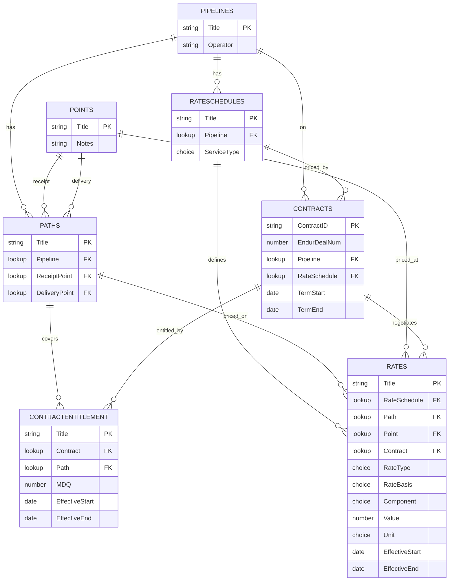

# Pipeline contract-rate database — build guide (FLARE)

Seven SharePoint lists on the FLARE site holding pipeline contract and rate data, built by hand. All data loads from your team's existing Excel sheets via Power Query — the small `Contracts` list is pasted in directly, and the monthly MDQ and rates sheets are reshaped into the entitlement and rate lists. No Copilot, no re-keying.

Everywhere `<tenant>` appears, use your SharePoint tenant so the URL reads `https://<tenant>.sharepoint.com/sites/FLARE`.

---

## Data model



**How the tables interact.** `Pipelines` is the root; `RateSchedules` and `Paths` hang off it. `Points` is a pipeline-agnostic registry of location names — a `Path` is a receipt→delivery pair, so it points at two `Points`, and the path is where a point's pipeline and role (receipt vs. delivery) actually get fixed. A `Contract` names one pipeline and one rate schedule. `ContractEntitlement` holds the contract's firm capacity — one row per contract, per path, per period — carrying the **MDQ** (which can be shaped over time). `Rates` holds every rate as a tall, effective-dated row — one per component (reservation, commodity, fuel, surcharge) — covering both the shared recourse curve and contract-specific negotiated rates. Costing ties together: an entitlement row supplies Path + MDQ, its contract supplies the RateSchedule, and `Rates` supplies the per-component charges for that schedule/path/window.

---

## Building the lists

### The procedure you repeat

**Create a list:** FLARE → **+ New → List → Blank list** → name it, confirm Save to FLARE. It starts with a `Title` column.

**Add a column:** **+ Add column** (right of the headers) → pick the type → configure → Save. Types used: Single line of text, Multiple lines of text, Number, Choice (one option per line), Date and time (turn **Include time** off), Hyperlink, Lookup.

**Add a lookup:** + Add column → **Lookup** → source = the parent list → column = **Title** → Save.

**Rename Title** where the natural key differs (Contracts): click `Title` header → Column settings → Edit → rename.

### Build order

Lookups need their parent to exist first:

**Pipelines → RateSchedules → Points → Paths → Contracts → ContractEntitlement → Rates**

### 1. Pipelines

The root dimension — one row per pipeline.

| Column | Type | Description |
|--------|------|-------------|
| `Title` | Text | Pipeline name; fix the spelling here, it's the lookup key |
| `Operator` | Text | Operating company |
| `Notes` | Long text | |

### 2. RateSchedules

The services a pipeline files (FT, IT, backbone, etc.). Give each a **pipeline-prefixed, unique Title** (`GTN FTS-1`, not bare `FTS-1`) so lookups can't match the wrong one.

| Column | Type | Description |
|--------|------|-------------|
| `Title` | Text | Prefixed schedule code, e.g. `GTN FTS-1` |
| `Pipeline` | Lookup → Pipelines | Which pipeline files it |
| `ServiceType` | Choice | Firm, Interruptible, Backhaul, Storage |
| `Notes` | Long text | |

### 3. Points

Atomic location names, spelled once and reused. Just a registry — a point's pipeline and its role (receipt vs. delivery) are **not** stored here, because a shared interconnect (Malin, Topock, Kingsgate) belongs to several pipelines and plays different roles on each. Both are carried by Paths instead (via the Path's Pipeline lookup and its ReceiptPoint/DeliveryPoint slots); for rates, pipeline comes through RateSchedule.

| Column | Type | Description |
|--------|------|-------------|
| `Title` | Text | Point name, e.g. Kingsgate, Malin, Topock, ABC border |
| `Notes` | Long text | |

### 4. Paths

A bridge list — a receipt→delivery pair. Path-based rates and firm transport contracts attach here. Use unique, prefixed Titles (`GTN Kingsgate-Malin`).

| Column | Type | Description |
|--------|------|-------------|
| `Title` | Text | e.g. `GTN Kingsgate-Malin` |
| `Pipeline` | Lookup → Pipelines | |
| `ReceiptPoint` | Lookup → Points | Origin point |
| `DeliveryPoint` | Lookup → Points | Destination point (second lookup into the same Points list — expected) |
| `Notes` | Long text | |

### 5. Contracts

One row per active contract. Rename `Title` → `ContractID` first.

| Column | Type | Description |
|--------|------|-------------|
| `ContractID` | Text (renamed Title) | Contract number/ID; the value entitlement and negotiated rates link to |
| `Counterparty` | Text | |
| `EndurDealNum` | Number | Deal number in Endur (trade capture) — the cross-reference to the system of record. Set 0 decimals, no thousands separator (it's an ID, not a value); consider Enforce unique values |
| `Pipeline` | Lookup → Pipelines | |
| `RateSchedule` | Lookup → RateSchedules | One rate schedule per contract |
| `TermStart` | Date | |
| `TermEnd` | Date | |
| `SourcePDF` | Hyperlink | Link to the contract PDF in the document library |
| `Notes` | Long text | Secondary points and other operational detail (see loading) |

No MDQ, Path, or RateType column here: MDQ is shaped and can span multiple paths (→ ContractEntitlement), and recourse-vs-negotiated is a property of each rate row (→ Rates). No MDQBasis either — whether a contract is flat, seasonal, or shaped is already determined by its entitlement rows (derive it in Power BI from the distinct MDQ values per contract), so storing it here would only duplicate that and risk drifting out of sync.

### 6. ContractEntitlement

The contract's firm capacity: one row per contract, per **primary** path, per validity window. Handles multi-path contracts (a row per path) and shaped MDQ (a row per period).

| Column | Type | Description |
|--------|------|-------------|
| `Title` | Text | Label, e.g. `GTN-1234 KGT-Malin 2024-11` |
| `Contract` | Lookup → Contracts | Cascade delete |
| `Path` | Lookup → Paths | The **primary** firm path this entitlement covers |
| `MDQ` | Number | Dth/d for this path in this window |
| `EffectiveStart` | Date | |
| `EffectiveEnd` | Date | |
| `Notes` | Long text | |

Build entitlement on **primary firm points only**. Secondary/alternate points carry no MDQ and no separate firm charge — they're operational flexibility, so they go in the contract's Notes, not as entitlement rows (loading them would double-count capacity).

### 7. Rates

The effective-dated rate fact table, stored **tall** — one row per rate component per validity window. Holds the shared recourse curve and contract-specific negotiated/discount rates in one list.

| Column | Type | Description |
|--------|------|-------------|
| `Title` | Text | Short label |
| `RateSchedule` | Lookup → RateSchedules | The service this component belongs to — set on **every** row, including fuel/commodity/surcharges, so costing can reach it |
| `Path` | Lookup → Paths | Filled for path-based rates; blank otherwise |
| `Point` | Lookup → Points | Filled for point/zone rates; blank otherwise |
| `Contract` | Lookup → Contracts | Blank for recourse; the ContractID for a negotiated/discount rate. Cascade delete |
| `RateType` | Choice — **required** | Recourse, Discount, Negotiated. The tariff-vs-negotiated flag |
| `RateBasis` | Choice | Path, Zone, Postage-stamp — how the rate is priced geographically |
| `Component` | Choice | Reservation, Commodity, Fuel, Surcharge |
| `ComponentDetail` | Text | Names a surcharge (ACA, EPC); blank for the core three |
| `Value` | Number | The rate figure only — no `$`, `%`, or commas |
| `Unit` | Choice — **required** | $/Dth/month, $/Dth/day, $/Dth, % |
| `EffectiveStart` | Date | Per component, so fuel can move on its own tracker cycle |
| `EffectiveEnd` | Date | |
| `SourceRef` | Hyperlink | Tariff sheet or negotiated agreement |

Three flags carry the meaning of a Rates row; understanding them is the key to the whole model:

**`RateType` — tariff vs. negotiated.** Read this to split the shared curve from contract rates (filter `RateType = Recourse` for the public curve). It's classified per row and required. `Contract` is separate and does a different job: `RateType` *classifies* a rate (what kind), `Contract` *identifies* it (whose). Two contracts can hold different negotiated rates on the same schedule/path/component/window, so only `Contract` makes each uniquely attributable. Keep both, tied by this invariant:
- `RateType = Recourse` ⇒ `Contract` **blank**
- `RateType = Negotiated`/`Discount` ⇒ `Contract` **filled**

A blank-Contract Negotiated row, or a filled-Contract Recourse row, is a data error (SharePoint can't enforce the cross-column rule; a validation pass or Power Automate check catches it).

**`RateBasis` — how the rate is priced geographically**, because not every rate attaches to a path. It says which geography column to read, and makes an empty one intentional rather than a suspected mistake:
- `Path` → fill `Path`, leave `Point` blank (most transport: a receipt→delivery pair)
- `Zone` → fill `Point` with the zone, leave `Path` blank
- `Postage-stamp` → leave **both** blank (one system-wide charge, e.g. most EPC/ACA surcharges)

Why it earns its place: validation (a `Path`-basis row with empty `Path` is an error, a `Postage-stamp` row with empty `Path` is correct — the flag tells them apart); costing (path rates join on `Path`, postage-stamp charges apply flat per contract — the DAX switches on `RateBasis`, and without it a system-wide charge would be smeared across every path); clean reporting (`RateBasis = Path` beats "rows where Path isn't blank").

**`Component` + `Unit` — the tall shape.** Each quote fans into rows (reservation, commodity, fuel, plus surcharges). `Unit` is mandatory because reservation ($/Dth/month), commodity ($/Dth), and fuel (%) share one `Value` column — the unit is the only thing that says how to read the number, so never sum `Value` across mixed units. Surcharges need no separate list: each is a `Component = Surcharge` row named in `ComponentDetail`.

That's four lookups (RateSchedule, Path, Point, Contract) — under SharePoint's per-view limit.

---

## Hardening after the lists exist

### Referential integrity

For each lookup: gear → **List settings** → click the column → **Relationship** section → check **Enforce relationship behavior** → pick the action. Enforcing auto-indexes the column; both lists must be single-value and on the same site; set it while lists are small/empty (can't enable over the 5,000-item threshold).

| Configure on (child list) | Lookup | Setting | Why |
|---|---|---|---|
| RateSchedules, Paths | Pipeline | Restrict delete | Protect the dimension tree |
| Paths | ReceiptPoint, DeliveryPoint | Restrict delete | Protect path definitions |
| Contracts | Pipeline, RateSchedule | Restrict delete | Protect contract records |
| ContractEntitlement | Path | Restrict delete | Don't wipe entitlement history |
| **ContractEntitlement** | **Contract** | **Cascade delete** | An entitlement dies with its contract |
| Rates | RateSchedule, Path, Point | Restrict delete | Don't wipe rate history |
| **Rates** | **Contract** | **Cascade delete** | A contract's negotiated rows die with it; recourse rows (blank Contract) are untouched |

### Required fields and indexing

Set **`RateType` and `Unit`** on Rates to required (column settings → "Require that this column contains information" → Yes). Index (List settings → **Indexed columns**): on Rates, `EffectiveStart`, `Component`, and `RateType` (the enforced lookups auto-index); on ContractEntitlement, `EffectiveStart`.

---

## Loading data — Excel + Power Query

Every list loads from trusted Excel data via Power Query — no Copilot, no staging workbook. `Contracts` is a small dimension you paste in directly. `ContractEntitlement` (MDQ) and `Rates` are wide monthly sheets reshaped into tall rows by the same deterministic pattern: numbers you already trust are moved, never re-keyed.

### A. Contracts — the small parent list

Contracts is a small dimension (a few dozen active contracts), so load it directly from wherever your team tracks contract metadata — grid-paste the columns (ContractID, Counterparty, EndurDealNum, Pipeline, RateSchedule, TermStart, TermEnd) or type them. Set `SourcePDF` after uploading each PDF; capture secondary points in `Notes`. `Pipeline` and `RateSchedule` must match your dimension-list Titles exactly. No automation needed at this size — but it must be loaded before the entitlement and negotiated-rate rows that look up ContractID.

### B. The reshape pattern (used for both ContractEntitlement and Rates)

Both the MDQ sheet and the rates sheet are wide matrices — a row per month, a column per series — turned tall by the same steps. Each has a small **map table** (below) that decodes its column headers; the mechanics are identical:

1. On a **copy** of the sheet, make it header row then month rows (no unit/label row wedged between). Select the range → **Insert → Table** → name it.
2. **Data → From Table/Range** to open it in Power Query.
3. Select the **month/date column** (or Year + Month if separate) → right-click → **Unpivot Other Columns**. The series columns collapse into `Attribute` + `Value`. (Use *Other* Columns so new columns added later melt automatically.)
4. Rename `Attribute` → `SourceHeader`. Confirm `Value` is a number (set type to Decimal if it shows "ABC"). Filter `Value` → uncheck **(null)**/blank to drop months before a series existed.
5. Load the map as a query first: click its table → **Data → From Table/Range** → **Close & Load To → Only Create Connection**.
6. On the data query: **Home → Merge Queries** → second table = the map → click `SourceHeader` in both → **Left Outer** → OK. Click the **expand icon** on the merged column → untick "Use original column name as prefix" → select all the map's fields → OK.
7. **Safety check:** filter the first mapped column for **(null)** — any rows are headers missing or misspelled in the map. Fix the map, Refresh, re-check until empty, then clear the filter. (This is the guarantee no column was silently dropped.)
8. **Add Column → Custom Column** for `EffectiveStart` = `Date.StartOfMonth([Month])` (or `#date([Year],[MonthNum],1)`) and `EffectiveEnd` = `Date.EndOfMonth([Month])`; set both column types to **Date**. Add a `Title` (formula per section).
9. Drop `Month` and `SourceHeader` (Home → Choose Columns), reorder to match the target list, **Close & Load To → Table**, and grid-paste into the list (Edit in grid view, batches of ~100–200). Each month: append new rows to the source, **Refresh All**, paste the new tall rows.

The result is one row per series per month — which handles flat, seasonal, and shaped values uniformly (a flat series just repeats the same number each month).

### C. ContractEntitlement — from the MDQ sheet

Map table **`ContractPathMap`**, one row per MDQ column:

`SourceHeader` | `Contract` | `Path`

- **`SourceHeader`** — exact header text from the MDQ sheet (the join key).
- **`Contract`** — the ContractID, matching a Contracts Title exactly.
- **`Path`** — the **primary** firm path, matching a Paths Title exactly.

Map **primary-path columns only** — secondary/alternate points carry no MDQ and aren't entitlement rows. Here `Value` is the MDQ (Dth/d). `Title` formula:

```
[Contract] & " " & [Path] & " " & Date.ToText([EffectiveStart], "yyyy-MM")
```

Output columns: `Title`, `Contract`, `Path`, `MDQ` (rename `Value`), `EffectiveStart`, `EffectiveEnd`. The null-check in step 7 is on `Contract`.

### D. Rates — from the monthly rates sheet

Map table **`ColumnMap`**, one row per rate column:

`SourceHeader` | `Pipeline` | `RateSchedule` | `Path` | `Point` | `RateBasis` | `RateType` | `Contract` | `Component` | `ComponentDetail` | `Unit`

Fill rules:
- **`SourceHeader`** — exact header text (the join key).
- **`Pipeline` / `RateSchedule` / `Path` / `Point`** — exact dimension-list Titles.
- **Geography follows `RateBasis`:** Path → fill `Path`, blank `Point`; Zone → fill `Point`, blank `Path`; Postage-stamp → both blank.
- **`RateType` / `Contract` follow the invariant:** recourse columns → `Recourse`, `Contract` blank; negotiated columns → `Negotiated`/`Discount`, `Contract` = the ContractID.
- **`RateSchedule` on every row**, including fuel, commodity, and surcharge columns (it's what makes them reachable in costing).
- **`Unit`** — from the unit row under each header in your source.

ACA fan-out: a single ACA column maps to **one row per FERC pipeline** — GTN, Ruby, El Paso (US interstate) — same FERC value each, `Component = Surcharge`, `ComponentDetail = ACA`, `RateBasis = Postage-stamp`. Skip CGT (CPUC intrastate), NGTL and Foothills (Canadian) — not FERC-jurisdictional, so no ACA. This is the one source column that fans out to several map rows.

Example rows:

| SourceHeader | Pipeline | RateSchedule | Path | Point | RateBasis | RateType | Contract | Component | ComponentDetail | Unit |
|---|---|---|---|---|---|---|---|---|---|---|
| Baja AFT Reservation Rate | CGT | CGT Backbone FT | CGT Baja (Topock-Citygate) | | Path | Recourse | | Reservation | | $/Dth/month |
| Fuel Rate Kingsgate to Malin | GTN | GTN FTS-1 | GTN Kingsgate-Malin | | Path | Recourse | | Fuel | | % |
| GTN-1234 Negotiated Reservation | GTN | GTN FTS-1 | GTN Kingsgate-Malin | | Path | Negotiated | GTN-1234 | Reservation | | $/Dth/month |
| Foothills ABC Border | Foothills | Foothills FS | | ABC border | Point | Recourse | | Reservation | | $/Dth/month |
| Ruby EPC charge | Ruby | Ruby FTS-1 | | | Postage-stamp | Recourse | | Surcharge | EPC | $/Dth |

Here `Value` is the rate figure. `Title` formula:

```
[RateSchedule] & " " & (if [Path] <> null then [Path] else if [Point] <> null then [Point] else "system") & " " & [Component] & (if [ComponentDetail] <> null then " " & [ComponentDetail] else "") & " " & Date.ToText([EffectiveStart], "yyyy-MM")
```

Output columns: `Title`, `RateSchedule`, `Path`, `Point`, `Contract`, `RateType`, `RateBasis`, `Component`, `ComponentDetail`, `Value`, `Unit`, `EffectiveStart`, `EffectiveEnd`. The null-check in step 7 is on `Pipeline` (map it in as a helper to check, then drop it — it isn't a Rates column).

**Percent gotcha:** if the sheet shows fuel as `2.50%`, Excel stores `0.025` — so the unpivot pulls `0.025`, not `2.5`. Pick one convention (store `2.5` with `Unit = %`) and apply it to every percent row; a stray `0.025` beside `2.5`s under-applies fuel 100×.

### Load order

**Pipelines, RateSchedules, Points → Paths → Contracts → ContractEntitlement, Rates**

Contracts before its children. Recourse rates (blank Contract) depend only on RateSchedules/Paths/Points; negotiated rates (filled Contract) and ContractEntitlement need Contracts first. A blank lookup cell after paste is the tell that a value didn't match a parent Title — fix the source and re-paste that batch.

## Connecting Power BI

### Connect and model

1. **Get data → SharePoint Online list** (not the older "SharePoint list") → the site URL `https://<tenant>.sharepoint.com/sites/FLARE` → **Organizational account** to sign in. Set the credential/privacy scope to the **site level** and privacy to **Organizational** (avoids later Formula.Firewall errors). Pick the list entities with friendly column names, not the raw `OData_*` feed. **Transform Data**, don't Load.
2. **Power Query cleanup, per list:** expand each lookup column (`Pipeline`, `RateSchedule`, `Path`, `Point`, `Contract`; both endpoints on Paths) and pull in the **Title** field, untick "use original column name as prefix" — this turns the lookup record into plain text. Set dates to Date, numbers to Decimal/Whole. Drop SharePoint system columns. Close & Apply.
3. **Relationships** (Model view) — the dimension is the "one" side, the fact the "many":
   - Pipelines[Title] → RateSchedules[Pipeline], Paths[Pipeline], Contracts[Pipeline]
   - RateSchedules[Title] → Rates[RateSchedule], Contracts[RateSchedule]
   - Paths[Title] → Rates[Path], ContractEntitlement[Path]
   - Points[Title] → Rates[Point]; and → Paths (ReceiptPoint + DeliveryPoint — **two** links, so one is active, one inactive/dashed; use `USERELATIONSHIP` inside a measure to reach the inactive one)
   - Contracts[ContractID] → Rates[Contract], ContractEntitlement[Contract]
   Keep every relationship **single-direction** (dimension filters fact). Relationships key on Title text, so a relationship that won't form or shows blanks is a spelling mismatch — same failure mode as the SharePoint lookups.

### Date table

Rate/entitlement rows are effective-dated *ranges*, not single dates, so the calendar drives measures rather than a relationship. **New table:**
```
DateTable =
ADDCOLUMNS ( CALENDAR ( DATE(2019,1,1), DATE(2030,12,31) ),
    "MonthStart", DATE ( YEAR([Date]), MONTH([Date]), 1 ) )
```
**Mark as date table** (Table tools). Do **not** relate it to Rates — the as-of logic references it inside the FILTER. Slice on `MonthStart` (data is monthly).

### The as-of measure pattern

"The rate on a date" = the row whose window contains that date. One measure per component (change the `Component` string); use `SUM` instead of `SELECTEDVALUE` for surcharges since a schedule can have several:
```
Reservation Rate =
VAR AsOf = MAX ( DateTable[Date] )
RETURN
CALCULATE (
    SELECTEDVALUE ( Rates[Value] ),
    Rates[Component] = "Reservation",
    Rates[RateType] = "Recourse",
    FILTER ( Rates,
        Rates[EffectiveStart] <= AsOf
        && ( Rates[EffectiveEnd] >= AsOf || ISBLANK ( Rates[EffectiveEnd] ) ) )
)
```
`SELECTEDVALUE` returns a number only when context narrows to one row (single schedule + path + month) — a blank means the context isn't narrowed or no window covers the date, not an error. Fuel's value is a percent; never add it to dollar components. Park measures on a dedicated `_Measures` table to keep the field list clean.

### Costing (needs ContractEntitlement)

Per component, prefer the contract's own row (`Contract` = it), else the recourse row (`RateType = Recourse`) — `COALESCE(contractRate, recourseRate)`. Path rates join on Path (entitlement Path + contract RateSchedule); **postage-stamp charges add flat per contract**, not per path (switch on `RateBasis`). Rate × MDQ = dollars.

### What you can build with vs. without ContractEntitlement

This is the key dependency. **Rates alone** (no entitlement) supports a **rate reference + history** tool and **recourse-vs-negotiated** comparisons — anything that's "what is the rate." It does **not** cleanly support a contract-anchored table with each contract's rate, because the contract→path link lives in ContractEntitlement — without it, Power BI can't tell which path's rate a contract pays, and rate columns blank out or demand a path slicer. Until entitlement is loaded, build two separate visuals rather than one merged table: a **contract register** (Contracts fields only — ContractID, Counterparty, Pipeline, RateSchedule, term, EndurDealNum — no rate measures, no path) and a **rate book** (RateSchedule + Path in a matrix with the rate measures and a month slicer). Loading ContractEntitlement is what unlocks the single contract-cost view (rate × MDQ).

---

## Data conventions

- **No in-place edits** to rates or entitlements — a change means closing the prior row's `EffectiveEnd` and adding a new row.
- **One source link per fact row** so any figure traces to a filing.
- **Version history on** (default) — your who-changed-what log.
- **Flags are truth, not decoration:** `RateType`, `RateBasis`, `Component`, `Unit` must be set on every applicable row; `RateType` and `Unit` are required on Rates.
- **The invariant:** Recourse ⇒ Contract blank; Negotiated/Discount ⇒ Contract filled. Validate periodically.
